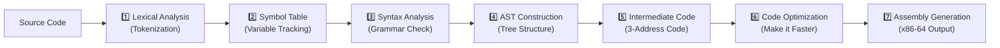

# Compiler-Lab-Final
# 🧠 Compiler Lab — Final Project

> **Welcome!** This is my journey of building a compiler from scratch — exploring **7 phases of compilation** through **6 different implementations**. Whether you're a fellow student or just curious about how compilers work, this README will guide you through everything you see in this repo.

---

## 📖 Table of Contents

1. [What is a Compiler?](#-what-is-a-compiler)
2. [The 7 Phases of Compilation](#-the-7-phases-of-compilation)
3. [Project Versions at a Glance](#-project-versions-at-a-glance)
4. [Version Details](#-version-details)
   - [Version 1: `compiler/` — C + Python Hybrid](#-version-1-compiler---c--python-hybrid)
   - [Version 2: `compiler-2/` — The Full Pipeline](#-version-2-compiler-2---the-full-pipeline)
   - [Version 3: `compiler-3/` — Three Separate Phases](#-version-3-compiler-3---three-separate-phases)
   - [Version 4: `compiler-4-python/` — Pure Python](#-version-4-compiler-4-python---pure-python)
   - [Version 5: `compiler-5-python-ply/` — PLY Library](#-version-5-compiler-5-python-ply---ply-library)
   - [Version 6: `compiler-6/` — Phase-by-Phase Breakdown](#-version-6-compiler-6---phase-by-phase-breakdown)
5. [Sample Programs (Input Language)](#-sample-programs-input-language)
6. [How to Run](#-how-to-run)
7. [What I Learned](#-what-i-learned)
8. [Screenshots](#-screenshots)

---

## 🔍 What is a Compiler?

A **compiler** is a program that translates code written in one language (the **source code**) into another language (usually **machine code** or **assembly**).

Think of it like a translator who reads English (source) and writes French (target), but in our case — we read a **C-like language** and produce **x86-64 assembly code** that a computer can actually run.

```
Source Code (C-like)  ──►  Compiler  ──►  Assembly (x86-64)
```

---

## 🏛️ The 7 Phases of Compilation

Every compiler (yes, even GCC and Clang!) goes through these steps. Here's what each phase does:



| Phase # | Phase Name              | What It Does                                                      | Tools Used                  |
| :-----: | ----------------------- | ----------------------------------------------------------------- | --------------------------- |
|  **1**  | **Lexical Analysis**    | Breaks source code into tokens (words like `int`, `=`, `10`, `;`) | Lex / Flex, or Python regex |
|  **2**  | **Symbol Table**        | Records every variable name, its type, and memory location        | Python                      |
|  **3**  | **Syntax Analysis**     | Checks if tokens follow the language grammar rules                | Bison / Yacc, or PLY        |
|  **4**  | **AST Construction**    | Builds a tree structure representing the code's logic             | Bison actions / Python      |
|  **5**  | **Intermediate Code**   | Converts the AST to 3-address code (like `t1 = a + b`)            | Python                      |
|  **6**  | **Code Optimization**   | Removes dead code, folds constants, makes code efficient          | Python                      |
|  **7**  | **Assembly Generation** | Translates optimized code to x86-64 assembly                      | Python                      |

---

## 📂 Project Versions at a Glance

This repo contains **6 different versions** of a compiler. Each one was built to try a different approach:

|  #  | Folder                   | Lexer   | Parser    | Backend | Best For                        |
| :-: | ------------------------ | ------- | --------- | ------- | ------------------------------- |
|  1  | `compiler/`              | Lex (C) | Bison (C) | Python  | Understanding C+Pipeline combo  |
|  2  | `compiler-2/`            | Lex (C) | Bison (C) | Python  | **Most complete version** 🔥    |
|  3  | `compiler-3/`            | Lex (C) | Bison (C) | Python  | Learning phase separation       |
|  4  | `compiler-4-python/`     | Python  | Python    | Python  | Understanding all-in-one Python |
|  5  | `compiler-5-python-ply/` | PLY     | PLY       | Python  | Learning PLY library            |
|  6  | `compiler-6/`            | Mixed   | Mixed     | Mixed   | **Best for learning phases** 📚 |

---

## 🗺️ Version Details

### 🟢 Version 1: `compiler/` — C + Python Hybrid

This was my **first attempt**. It uses:

- **Lex** (C) — to tokenize the source code
- **Bison** (C) — to parse the tokens and build an AST
- **Python** — for all the backend phases

**How to run:**

```bash
cd compiler
chmod +x run.sh
./run.sh
```

**What I built here:**

- `lexer/lexer.l` — Lex rules for tokenizing (numbers, identifiers, operators)
- `parser/parser.y` — Bison grammar for parsing assignments
- `python_stages/semantic_analyzer.py` — Checks variable usage
- `python_stages/intermediate_code.py` — Generates 3-address code
- `python_stages/optimizer.py` — Simple optimization (removes useless ops)
- `python_stages/codegen.py` — Produces assembly output

> 🎯 **Goal:** Get all 7 phases working end-to-end, even if simple.

---

### 🔵 Version 2: `compiler-2/` — The Full Pipeline

This is the **most polished version** in the repo. It has a proper `Makefile`, supports **if/else, while loops, print, return**, and generates real **x86-64 assembly**.

**Source language features:**

- ✅ `int` and `float` data types
- ✅ Variable declarations with/without initialization
- ✅ Arithmetic: `+`, `-`, `*`, `/`
- ✅ Comparisons: `==`, `<`, `>`, `<=`, `>=`
- ✅ `if` / `else` statements
- ✅ `while` loops
- ✅ `print()` built-in function
- ✅ `return` statement
- ✅ Single-line comments (`//`)

**How to run:**

```bash
cd compiler-2

# Build everything
make all

# Run with example program
make test

# Or compile your own file
make compile INPUT=example.txt

# Or compile, assemble, and run!
make run INPUT=example.txt
```

**What gets generated:**

1. `ast.json` — The Abstract Syntax Tree
2. `output.s` — x86-64 Assembly code
3. `program` — Executable binary

**Example input → output:**

_Input (`example.txt`):_

```c
int x = 10;
int y = 20;
int z = x + y;

if (z > 50) {
    print(z);
}
```

_Generated Assembly (`output.s`):_

```asm
.section .data
fmt: .string "%d\n"

.section .text
.globl main
main:
    pushq %rbp
    movq %rsp, %rbp
    subq $24, %rsp
    movq $10, [rbp-0]
    movq $20, [rbp-4]
    movq [rbp-0], %rax
    addq [rbp-4], %rax
    movq %rax, [rbp-8]
    ...
```

> 🔥 **This is the version to start with if you want to see a complete compiler!**

---

### 🟡 Version 3: `compiler-3/` — Three Separate Phases

This version splits the compiler into **3 clear phases**, each independent:

| Phase | File                     | What It Does                        |
| :---: | ------------------------ | ----------------------------------- |
| **1** | `phase1_lexer.l`         | Lexical analysis — generates tokens |
| **2** | `phase2_symbol_table.py` | Reads source, creates symbol table  |
| **3** | `phase3_parser.y`        | Bison grammar + parser              |

**How to run:**

```bash
cd compiler-3

# Phase 1: Lexical Analysis
flex phase1_lexer.l
gcc lex.yy.c -o lexer -lfl
./lexer input/test_input.c

# Phase 2: Symbol Table
python3 phase2_symbol_table.py input/test_input.c > symbols.txt

# Phase 3: Syntax Analysis
bison -d phase3_parser.y
flex phase1_lexer.l
gcc phase3_parser.tab.c lex.yy.c -o parser -lfl
./parser input/test_input.c
```

> 🎯 Great for **understanding each stage independently**.

---

### 🟠 Version 4: `compiler-4-python/` — Pure Python

Everything is written in **pure Python** — no Lex or Bison needed! The lexer uses `re` (regex) and the parser is built manually.

**Files:**

- `mini-compiler.py` — The entire compiler in one file
- `test.c` — Sample input

**How to run:**

```bash
cd compiler-4-python
python3 mini-compiler.py test.c
```

> 🎯 Perfect if you want to see **how a compiler works without any external tools**.

---

### 🟣 Version 5: `compiler-5-python-ply/` — PLY Library

This version uses **PLY** (Python Lex-Yacc) — a Python implementation of Lex and Yacc. It's the most feature-rich Python version, supporting:

- ✅ `int`, `float`, `char`, `void` data types
- ✅ Functions with parameters
- ✅ `if`/`else`, `while`, `for` loops
- ✅ Full operator support (including `&&`, `||`, `!`, `++`, `--`)
- ✅ String and character literals

**How to run:**

```bash
cd compiler-5-python-ply

# Install PLY if you haven't
pip install ply

# Run the compiler
python3 mini-compiler.py test.c
```

There are two files in this version:

- `mini-compiler.py` — Full compiler with functions support
- `mini-compiler1.py` — A simpler version

> 🎯 Best if you're curious about **how Lex/Yacc work but prefer staying in Python**.

---

### 🟤 Version 6: `compiler-6/` — Phase-by-Phase Breakdown

This is the **most educational version**. Each phase of compilation lives in its own folder as an independent mini-project.

```
compiler-6/
├── 1.lexical-analyzer/      # Flex/Lex tokenizer
├── 2.symbol-table/          # Bison + symbol table
├── 3.syntax-analyzer/       # Grammar validation
├── 4.abstract-syntax-tree/  # AST construction in Python
├── 5.intermediate-code/     # 3-address code generation
├── 6.code-optimization/     # Constant folding & propagation
└── 7.assembly-code-generation/  # x86-64 assembly output
```

Each folder has its own `readme.md` with instructions.

> 🎯 **Start here if you're learning compilers step by step!**

---

## 💻 Sample Programs (Input Language)

The language our compiler understands looks a lot like C, but much simpler:

### Hello World (sort of)

```c
int x = 42;
print(x);
```

### Arithmetic

```c
int a = 5;
int b = 10;
int c = a + b;
int d = c * 2;
```

### Conditionals

```c
if (x > y) {
    print(x);
} else {
    print(y);
}
```

### Loops

```c
int i = 0;
while (i < 5) {
    i = i + 1;
}
```

### Full Example (from `compiler-2/example.txt`)

```c
int x = 10;
int y = 20;
int z;

z = x + y;

int result = z * 2;

if (result > 50) {
    int a = 100;
    print(a);
}

int counter = 0;
while (counter < 5) {
    counter = counter + 1;
}

print(result);
return result;
```

---

## 🚀 How to Run

### Quick Start (recommended version)

```bash
cd compiler-2
make all
make test
```

### Prerequisites

You'll need these installed:

```bash
# Ubuntu/Debian
sudo apt-get install flex bison gcc make python3

# macOS
brew install flex bison gcc make python3

# Fedora/RHEL
sudo dnf install flex bison gcc make python3

# Python packages (for versions 4 & 5)
pip install ply
```

---

## 📸 Screenshots

The `screenshots/` folder contains output screenshots from various stages:

| File              | Description              |
| ----------------- | ------------------------ |
| `1.png`           | Lexical Analysis output  |
| `2.png`           | Symbol Table output      |
| `3.png`           | Syntax Analysis output   |
| `4.png`           | AST output               |
| `5.png`           | Intermediate Code output |
| `6.png`           | Optimization output      |
| `7.png`           | Assembly Code output     |
| `input.png`       | Input source code        |
| `buggy_input.png` | Testing with errors      |

Check out the `screenshots/` folder to see the compiler in action!

---

## 🎓 What I Learned

Building this compiler taught me:

1. **Lexical Analysis is like solving a puzzle** — figuring out how to break code into the right tokens is harder than it sounds
2. **Grammar design matters** — a poorly designed grammar leads to shift/reduce conflicts in Bison
3. **ASTs make everything easier** — once you have a tree, code generation becomes much more manageable
4. **Optimization is fascinating** — constant folding and dead code elimination can make a real difference
5. **There are many ways to build a compiler** — C tools (Lex/Bison), pure Python, or PLY — each has trade-offs

---

## 📚 References

- [Lex & Yacc Tutorial](https://www.epaperpress.com/lexandyacc/) — The classic guide
- [PLY (Python Lex-Yacc)](https://www.dabeaz.com/ply/) — Python implementation
- [GCC x86-64 Assembly](https://gcc.gnu.org/onlinedocs/gcc/x86-Options.html) — Assembly reference

---

## 🙏 Final Thoughts

This project was built as a **Compiler Lab final project** for university. It started simple and grew into 6 different versions as I explored different tools and approaches. If you're a student working on something similar — don't stress! Start with **compiler-6** (phase by phase), then try **compiler-2** (the full pipeline), and you'll see how it all fits together.

> **"A compiler is just a program that transforms one thing into another. You've written programs before — you can write a compiler too!"**

---

⭐ **Happy Compiling!** ⭐
